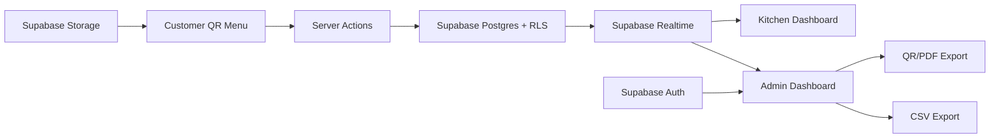
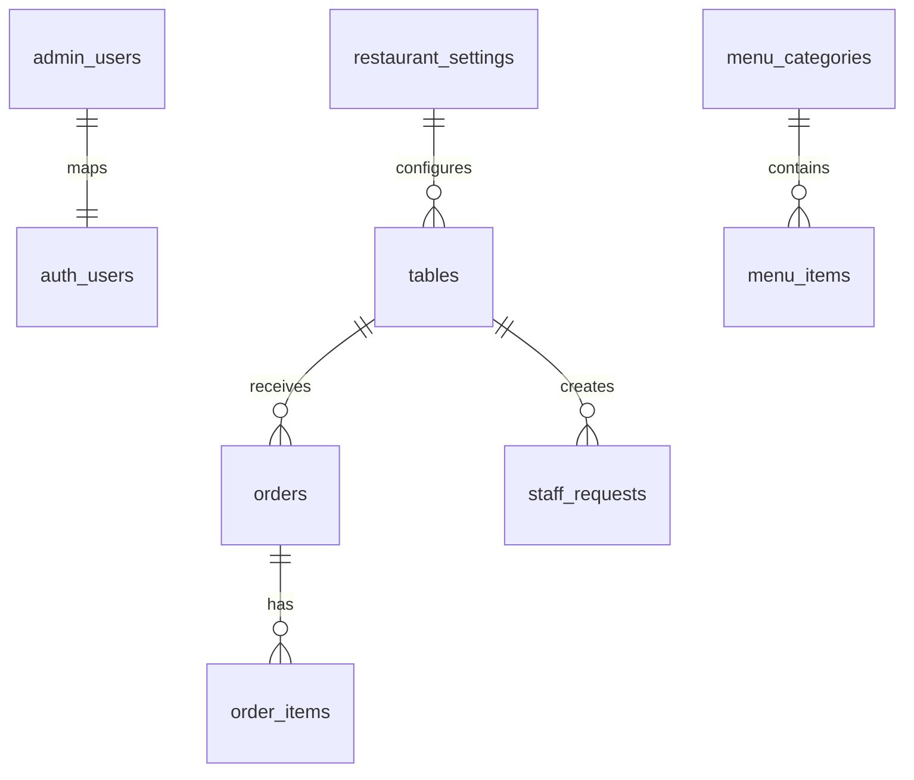

# NOVA Restaurant Operations QR System

Portfolio-quality restaurant QR ordering and operations demo built with Next.js 15, React, TypeScript, Tailwind CSS, Supabase, Zustand, Recharts, Framer Motion, Sonner, Lucide, and Vercel-ready structure.

## Features

- Customer QR menu with table-aware URLs, cart, checkout, confirmation, tracking, and staff calls.
- Supabase-backed order creation, order items, staff requests, restaurant settings, menu data, and tables.
- Kitchen dashboard with PIN access, realtime order cards, staff request alerts, and persisted status progression.
- Admin dashboard with Supabase Auth protection, estimated order value metrics, busy-hour chart, order search, CSV export, menu availability, table status, QR downloads, printable QR sheet, ordering toggle, and demo reset.
- Dark/light mode, polished restaurant branding, loading state, error boundary, responsive layouts.
- Supabase SQL schema included for production database, RLS, storage, and realtime setup.

## White-label Template

The app is structured like a reusable restaurant template. To create a new restaurant version, update these files first:

- `src/config/restaurant.ts` for restaurant name, tagline, contact details, SEO, theme colors, logo, hero image, and demo presentation copy.
- `src/data/menu.ts` for categories, menu items, prices, availability, and food imagery.
- `public/demo/steakhouse/` for grouped logo/favicon/demo assets.

The current theme is `steakhouse`. Future themes such as Japanese, cafe, Italian, and fast food can be added by extending the `ThemeConfig` shape without changing page components.

## Quick Start

```bash
npm install
npm run dev
```

Open:

- Customer demo: `http://localhost:3000/menu?table=1`
- Kitchen demo: `http://localhost:3000/kitchen` with PIN `123456`
- Admin demo: `http://localhost:3000/admin`

## Scripts

```bash
npm run dev
npm run typecheck
npm run lint
npm run build
```

## Architecture



## ER Diagram



## Folder Structure

```text
src/
  app/
  components/
    admin/
    kitchen/
    restaurant/
    shared/
  config/
  data/
  lib/
    supabase/
  store/
  types/
public/
  demo/
    steakhouse/
supabase/
  schema.sql
PROJECT_RULES.md
UI_RULES.md
```

## Supabase Setup

1. Create a Supabase project.
2. Copy `.env.example` to `.env.local`.
3. Add `NEXT_PUBLIC_SUPABASE_URL` and `NEXT_PUBLIC_SUPABASE_ANON_KEY`.
4. Add `SUPABASE_SERVICE_ROLE_KEY` only on the server/Vercel environment. Never expose it in browser code.
5. Run `supabase/schema.sql` in the SQL editor.
6. Create storage buckets:
   - `food-images`
   - `branding-assets`
7. Enable Realtime for:
   - `orders`
   - `order_items`
   - `staff_requests`
   - `tables`
8. Create an admin auth user and insert its `auth.users.id` into `admin_users`.

```sql
insert into public.admin_users (user_id, role)
values ('AUTH_USER_ID_HERE', 'owner');
```

Kitchen PIN defaults to `123456` in `restaurant_settings.kitchen_pin`.

## Vercel Deployment

This project is ready for Vercel as a standard Next.js App Router application.

### Required Environment Variables

Add these in **Vercel Project Settings -> Environment Variables** for Production and Preview:

```env
NEXT_PUBLIC_SUPABASE_URL=https://your-project-ref.supabase.co
NEXT_PUBLIC_SUPABASE_ANON_KEY=your_publishable_or_anon_key
SUPABASE_SERVICE_ROLE_KEY=your_secret_or_service_role_key
NEXT_PUBLIC_SITE_URL=https://your-vercel-domain.vercel.app
```

Rules:

- `NEXT_PUBLIC_SUPABASE_URL` and `NEXT_PUBLIC_SUPABASE_ANON_KEY` are public client-safe values.
- `SUPABASE_SERVICE_ROLE_KEY` is server-only. Never expose it in browser code or screenshots.
- After changing Vercel environment variables, redeploy the project.

### Supabase Production Checklist

1. Run `supabase/schema.sql` in the Supabase SQL editor.
2. Create an Auth user for the owner.
3. Link the Auth user to `admin_users`:

```sql
insert into public.admin_users (user_id, role)
select id, 'owner'
from auth.users
where email = 'OWNER_EMAIL_HERE'
on conflict (user_id) do update
set role = 'owner';
```

4. Enable Realtime for:
   - `orders`
   - `order_items`
   - `staff_requests`
   - `tables`
5. Create public storage buckets if you use uploads:
   - `food-images`
   - `branding-assets`

### Vercel Build Settings

Vercel should auto-detect:

- Framework Preset: `Next.js`
- Install Command: `npm install`
- Build Command: `npm run build`
- Output Directory: `.next`

No `vercel.json` is required for the current single-app setup.

### Post-Deploy Smoke Test

After deployment:

1. Open `/menu?table=1` and create a test order.
2. Confirm rows appear in Supabase `orders` and `order_items`.
3. Open `/kitchen`, enter the Kitchen PIN, and confirm the order appears.
4. Open `/admin`, sign in with the Supabase Auth owner, and confirm dashboard data loads.

## Customization Guide

- Restaurant branding lives in `src/lib/demo-data.ts` for the local demo.
- Production branding should be stored in `restaurant_settings`.
- Update menu categories and items in `src/lib/demo-data.ts` or Supabase tables.
- Replace image URLs with Supabase Storage public URLs for production.

## Roadmap

- Real Supabase server actions wired to every mutation.
- Online payment.
- Reservations.
- Inventory.
- Loyalty and coupons.
- Multi-restaurant and multi-branch support.
- Kitchen ticket printing.
- Customer accounts.
- SMS and email notifications.

## Sprint Status

Completed in this implementation:

- Sprint 1 foundation and design system.
- UI Polish Sprint.
- Sprint 2 backend migration:
  - Supabase Auth for admin routes.
  - Supabase-backed menu, settings, tables, orders, order items, staff requests.
  - Server actions for order creation, status updates, staff requests, table status, admin toggles, and reset.
  - Realtime subscriptions for orders, order items, staff requests, tables, menu items, menu categories, and restaurant settings.
  - RLS policies and seed data in `supabase/schema.sql`.

Known limitation:

- Without `.env.local`, the app falls back to local demo data so it can still build and preview.
- With Supabase configured, persistent data comes from Supabase. Zustand is kept for cart/UI state only.
- Kitchen realtime reads use anon SELECT policies so Realtime can deliver updates; kitchen writes go through server actions that verify the PIN and use the server-only service role key.
